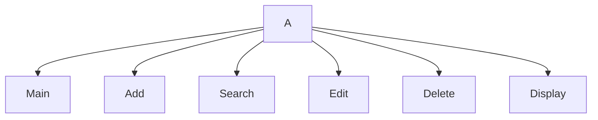

# Chapter 6 Project
Bricen, Roman

## <Contact Manager> Description
Our program creates a list of contacts

### <Contact Manager> Flowchart

#### Function Diagrams

| `Main`    |               |  Roman     |
| ------------------ | ------------- | ------------ |
| `argument:type`    | takes input from the user for ____  |              |
| `time:integer`     | calculates ______  | outputs ____             |
| `name:string`      | takes input for name ___ | returns total |
***
| `Add Contact`    |               |     Roman   |
| ------------------ | ------------- | ------------ |
| `argument:type`    | takes input from the user for ____  |              |
| `time:integer`     | calculates ______  | outputs ____             |
| `name:string`      | takes input for name ___ | returns total |
***
| `Search`    |               |     Bricen   |
| ------------------ | ------------- | ------------ |
| `argument:type`    | takes input from the user for a contact  |              |
| `time:integer`     | calculates if the contact exists  | outputs yes or no             |
| `name:string`      | takes input for the information | returns contact information |
***
| `Edit Contact`    |               |     Bricen   |
| ------------------ | ------------- | ------------ |
| `argument:type`    | takes input from the user for a contact  |              |
| `time:integer`     | calculates changes made for a contact  | outputs new changes             |
| `name:string`      | takes input for contact to be changed | returns new changes |
***
| `Delete Contact`    |               |     Bricen   |
| ------------------ | ------------- | ------------ |
| `argument:type`    | takes input from the user for which contact to delete  |              |
| `time:integer`     | calculates if there is a contact to delete  | outputs if the contact has been deleted or not             |
| `name:string`      | takes input for existing contacts | returns if the contact exists |
***
| `Display Contact`    |               |     Roman   |
| ------------------ | ------------- | ------------ |
| `argument:type`    | takes input from the user for ____  |              |
| `time:integer`     | calculates ______  | outputs ____             |
| `name:string`      | takes input for name ___ | returns total |
***
